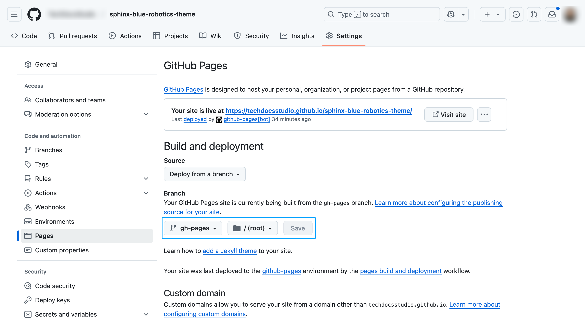
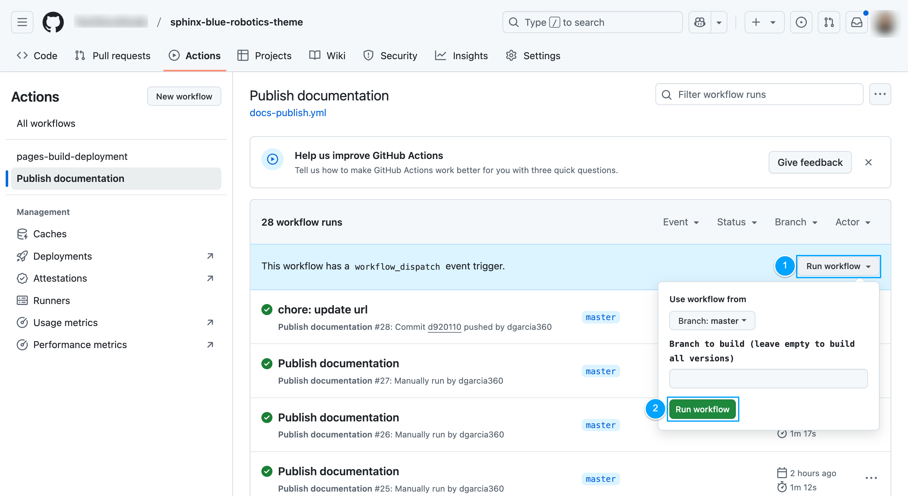
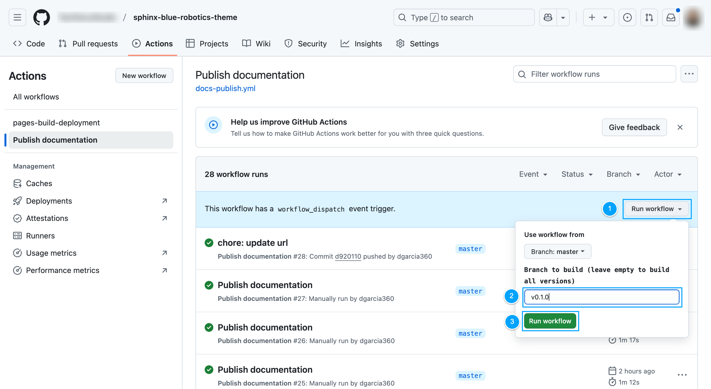

# Deployment

This document outlines the steps for deploying documentation using GitHub Actions.

## Installation

Before deploying your documentation, you need to configure GitHub Actions and ensure that your repository is ready to handle deployments.

### Basic configuration

To configure deployment support in your project, follow these steps:

1. Copy the [docs-publish.yml](https://github.com/bluerobotics/sphinx-blue-robotics-theme/blob/master/.github/workflows/docs-publish.yml) workflow into your project's `.github/workflows` folder.

2. In `docs-publish.yml`, ensure that the default branch matches your repository settings:

  ```yaml
  on:
  push:
      branches:
      - master
  ```

3. Review `docs/versions.yml` to ensure there is one version with `is_default` set to `true`.

4. Review `docs/conf.py` to define the URL of your project:

  ```
  SITE_URL = "https://bluerobotics.github.io/sphinx-blue-robotics-theme/"
  ```

5. Push your changes to the repository.

### GitHub Pages configuration

Once you have completed the basic setup, you need to configure GitHub Pages to serve your documentation.

By default, the workflow supports publishing to GitHub Pages. You can modify the `deploy` step in the workflow to publish to other platforms.

To publish to GitHub Pages:

1. Create a new branch named `gh-pages` in your repository:

  ```
  git checkout --orphan gh-pages 
  git rm -rf .
  git commit --allow-empty -m "Initial gh-pages branch"
  git push origin gh-pages
  ```

2. Enable GitHub Pages:

  * Go to **Settings > Pages** in your GitHub repository.
  * Set the source to the `gh-pages` branch.

      

  * GitHub will use this branch to serve your documentation.

3. Publish all versions for the first time. See Publish all versions below for details.

### Publish all versions

Now that you’ve set up GitHub Pages, you can deploy all versions of the documentation.

Publishing all versions is useful for the initial deployment or when making significant changes, as it ensures that every version defined in the file `docs/versions.json` is built from scratch.

To build all versions of the documentation, follow these steps:

1. Ensure that all versions are listed in `docs/versions.json`.

2. Trigger the [workflow manually](https://docs.github.com/en/actions/managing-workflow-runs-and-deployments/managing-workflow-runs/manually-running-a-workflow) from the default branch without specifying a branch.

  

3. Once the workflow completes successfully, the documentation will be deployed. If the workflow fails, review the logs to identify and resolve any issues.

## Maintenance guides

Once the initial deployment is complete, you can publish new versions or update existing ones as needed.

### Publish a new version

To publish a new version of the documentation, follow these steps:

1. In your default branch, add a new entry for the version in the `docs/versions`.json file. Specify the version name, branch, and whether it is the default version. Example:

  ```json
  {
    "name": "v3.0",
    "branch": "v3.0",
    "is_default": false
  }
  ```

2. [Trigger the workflow manually](https://docs.github.com/en/actions/managing-workflow-runs-and-deployments/managing-workflow-runs/manually-running-a-workflow) via GitHub Actions:

  

  - **Build all versions**: Leave the branch field empty to build documentation for all versions listed in `docs/versions.json`.
  - **Build a specific version**: Specify a branch to only build the documentation for that version.

  ```{admonition} Important
  In both cases, choose to build the workflow from the `master` branch.
  ```

3. Once the workflow completes successfully, the new version will be deployed. If the workflow fails, review the logs to identify and resolve any issues.

### Set the default version

In the `docs/versions.json` file, you can specify the default version. This version will be used to redirect the root of the domain to the selected version. Only one version can be set as the default at a time.

To set the default version, update the versions.json file by setting the `is_default` field to `true` for the version you want to designate as the default:

```json
{
  "name": "v3.0",
  "branch": "v3.0",
  "is_default": true
}
```

After making this change, push your updates and republish the version.

### Republish an existing version

To update an existing version, [trigger the workflow manually](https://docs.github.com/en/actions/managing-workflow-runs-and-deployments/managing-workflow-runs/manually-running-a-workflow) setting the branch name you want to rebuild.

This is useful when content in the versioned branch has changed and you want to reflect those updates in the documentation.


### Hide the default branch

By default, the default repository branch is always built and published. This allows you to view the latest version of the documentation before publishing.

If you want to hide the default branch from the version selector, add the default branch name to the `hide_versions` theme options in  your `docs/conf.py`:

```
html_theme_options = {
    "hide_versions": ['master'],
}
```

This will prevent the default branch from appearing in the version selector, while still allowing it to be built and published.


If you want to completely remove the default branch from the workflow and prevent it from being built or published, exclude it from the `docs/versions.json` file and remove the following section that pushes the master branch to GitHub Pages:

```
on:
  push:
    branches:
    - master
```

## Reference

The following reference section explains key elements of the workflow, how versions are managed, and the structure of the configuration.

### Workflow overview

The workflow that builds the documentation is located in `.github/workflows/docs-publish.yml`.

The documentation is built and deployed using the following steps:

1. **Preparation**: The workflow starts by checking the repository's default branch and extracting version information from the `versions.json` file.
2. **Building documentation**: The documentation is built for each version defined in the `versions.json` file. You can edit the default branch name from `master` to match your repository settings.
3. **Deploying documentation**: The built documentation is deployed to the `gh-pages` branch, where each version is stored in its respective folder. You can configure this step of the workflow to deploy to different hosting platforms.

Additional notes:
- If you push to the default branch docs folder, the workflow will automatically build and deploy the default branch version of the documentation.
- If you trigger the workflow manually, you can either build a specific version or build all versions defined in the `versions.json` file.

### Versions file

The `versions.json` file is at the core of this multiversion setup. This file defines the versions available for the project, and it is used to control which versions of the documentation are built and deployed. Here’s an example of how it might look:

```json
{
  "versions": [
    {
      "name": "v1.0",
      "branch": "v1.0",
      "is_default": true
    },
    {
      "name": "v2.0",
      "branch": "v2.0",
      "is_default": false
    }
  ]
}
```

In this example:

- `name`: The version name. This will be used to define the URL structure for the documentation.
- `branch`: Corresponds to the branch in your repository that the version will be built from.
- `is_default`: This field indicates the default version to which users will be redirected when they visit the documentation site without specifying a version. Ensure that only one version is marked as the default.

